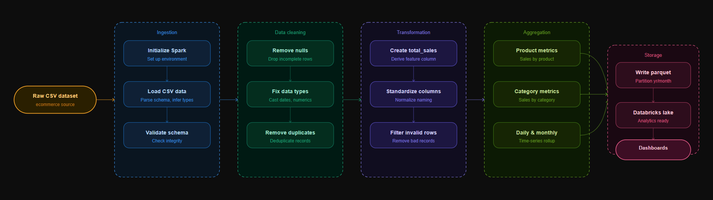

# Spark Retail ETL Pipeline

A complete **ETL (Extract–Transform–Load) pipeline** built using Apache Spark and PySpark to process retail transaction data, perform analytics, and store optimized datasets for further analysis.

This project demonstrates how **big data tools can clean, transform, and analyze real-world retail data efficiently.**

---

# Project Architecture

---

#  Project Overview

Retail companies generate massive amounts of transactional data.  
Processing this raw data directly is inefficient and unreliable due to:

- Missing values
- Incorrect formats
- Negative quantities
- Inconsistent timestamps

This project builds a **data engineering pipeline using Spark** to:

1. Extract raw retail data
2. Clean and preprocess the data
3. Perform feature engineering
4. Generate business insights
5. Store processed data in optimized format

---

#  Technologies Used

| Technology | Purpose |
|------------|--------|
| Apache Spark | Distributed data processing |
| PySpark | Spark Python API |
| Python | Data transformation |
| Parquet | Optimized columnar storage |
| Databricks | Development environment |

---

#  Dataset Used

This project uses the **Online Retail Dataset**, containing real-world transaction data from an online store between **2010 and 2011**.

## Dataset Columns

| Column | Description |
|------|-------------|
| InvoiceNo | Unique transaction ID |
| StockCode | Product code |
| Description | Product name |
| Quantity | Number of items purchased |
| InvoiceDate | Transaction timestamp |
| UnitPrice | Price per item |
| CustomerID | Unique customer identifier |
| Country | Customer location |

---

#  ETL Pipeline Result

